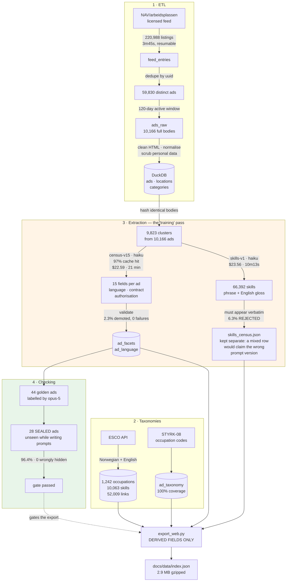
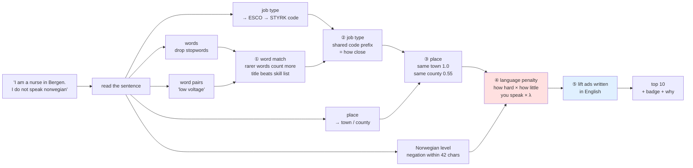

# Smart Search — job search that respects what you can't do

**Say what you can't do, and this listens.** Type *"I'm a nurse in Bergen and I don't speak
Norwegian"* and you get nursing jobs in and around Bergen, each one marked with whether the
language will shut you out. For that query the answer is brutal: of 1,151 nursing and care
ads, **exactly one** is open to an English speaker, and it isn't in Bergen. The point is that
you're told on the first screen instead of finding out a thousand ads later. Ask as a software
developer and 28% are open.

Ordinary keyword search gets this backwards. It matches words, so *mentioning* Norwegian drags
you toward the jobs that demand it — measured here, saying you don't speak it made results
**worse** for 5 out of 5 test seekers. So this doesn't match text. It pulls your sentence apart
into the things it actually asks for — language, place, kind of work, experience — and checks
each one against what the ad requires. Every result shows its working.

**[▶ Live demo](https://naomititus.github.io/finnno_smart_search/)** · **[What these numbers
don't support](LIMITATIONS.md)** · [Architecture](ARCHITECTURE.md) · [Decisions](DECISIONS.md)

> **Scope.** One market — NAV/arbeidsplassen's licensed feed, 10,166 active ads over 120 days
> (FINN ads aren't in that feed). **Four of the fifteen things extracted from each ad reach the ranking**, plus
> location, occupation and skills from elsewhere; **the other eleven are extracted and stored
> but affect nothing** (§4, §11). No CV upload, no personalisation, no learning-to-rank, no
> incremental crawl. **The live page's ranking has never been judged** — every confidence
> interval below comes from the Python pipeline (§22).

---

## Headline

| | | |
|---|---:|---|
| **Language extraction** | **96.4%** (27/28) | on a sealed set never seen while writing the prompt · **0** workable ads wrongly hidden |
| **Blocked jobs in the top 10** | **halved**, 0.154 → 0.077 | 378 relevance judgments; 95% CI excludes zero |
| **Query speed** | **166 ms** p50 · 198 ms p95 | scores all 10,166 ads in the browser · `scripts/bench_page.mjs` |
| **Ready to type** | ~450 ms after download | 2.9 MB gzipped · 100 ms parse · 343 ms index build |
| **Servers at query time** | **none** | static GitHub Pages — no API, no vector DB, no backend |
| **Cost** | **$0.0045**/ad → **~$54/month** | $46.15 ÷ 10,166 ads, at ~388 new ads/day. Plus $8.30 once |
| **Extraction** | `claude-haiku-4-5` | both censuses, 9,379 + 9,823 calls, 0 failures |
| **Judging & labels** | `claude-opus-5` | the one place a cheap model can't be fixed by better prompting |
| **Throughput** | 9,823 ads in **10m13s** | one Batch API submission |

**Why two models.** The same skills prompt ran on both: Opus recall **0.868**, Haiku **0.861**
— the difference is noise — for **$130 vs $23** across the corpus. So extraction is Haiku, and
the money goes where a weak model can't be rescued by re-prompting: the **judge** that decides
whether any of this works, and the **labels** Haiku is graded against. At a million ads that's
~$4.5k of Haiku against ~$23k of Opus, and the judging bill doesn't grow with the corpus at
all.

### What it costs

Three different kinds of money. Conflating them is how a pilot budget gets mis-sold. Every
figure is real token usage pulled from the Batch API — my own estimates were out by 38% one
way and 18% the other.

**Ongoing, the only cost that recurs.** Each new ad is tagged once:

| | total | per ad | per 1,000 |
|---|---:|---:|---:|
| facts (`census-v15`, 15 fields per ad) | $22.59 | $0.00222 | $2.22 |
| skills (`skills-v1`, 6.5 skills/ad) | $23.56 | $0.00232 | $2.32 |
| **total** | **$46.15** | **$0.00454** | **$4.54** |

At the measured arrival rate of **~388 new ads/day**, that's **~$54/month** to keep the whole
Norwegian market tagged. Serving queries costs nothing — the front end is static.

**The obvious saving isn't available, which is worth saying.** The facts census ran at a **97%
prompt-cache hit rate**; the skills census ran at **0%**. Caching looks like an easy win since
the instructions are ~62% of each call — but the prompt puts the **ad first and instructions
after**, so two prompts share only ~98 characters. That's far below Haiku's 2,048-token
minimum, so turning caching on today would cache *nothing*. Getting it needs the prompt
reordered and the extraction re-validated.

**One-off R&D — $8.30**, and it doesn't grow with the corpus: $2.42 on 18 prompt-development
runs, $1.33 on pilots, **$4.55 on 378 relevance judgments**. Judging costs the same at 10,000
ads or 10 million. Proving the thing works cost less than $9 — excluding my time, which
dominated.

**One-off backfill — $46.15** for the existing 10,166 ads, or **~$4,500 per million**. That's
the figure for a market you haven't indexed yet. On Opus it'd be ~$23,000 per million, for
+0.007 recall.

---

## The problem

A job lists what it needs. You have what you have. The job works for you only if **everything
it needs is something you have** — and that relation runs one way only:

| the job needs | you fall short | you have more than asked |
|---|---|---|
| professional Norwegian | fatal | free |
| to be in Bergen | the next town over is a *near-miss*, not a miss | free |
| 5 years' experience | disqualifying | free |
| security clearance | fatal | free |

Embeddings can't express that difference. Cosine similarity is **symmetric** — it has no way
to tell "needs Norwegian, you have none" from "you speak Norwegian, the job never asked". So
no encoder, at any size, can rank on it. The fix isn't a bigger model; it's to pull the
requirements out of both sides and check them one by one, in a stage you can turn up or down.

**Language is the sharpest case,** and it was measured before it was claimed. Only 956 of
10,166 ads (9.4%) are open to an English speaker, so this one constraint decides almost the
whole corpus. And embeddings get it backwards: *"jeg snakker ikke norsk"* and *"jeg snakker
flytende norsk"* sit at **cosine 0.914**, and saying you don't speak Norwegian moved seekers
*closer* to the jobs demanding it on **5 of 5** personas.

**Location is the same shape, softer.** It's data, not a word to match — 99.1% of ads name a
municipality — and nearness isn't yes/no: a neighbouring town in the same county is
commutable, so it scores 0.55 rather than 0. 7.1% of ads list several places, so an ad is
judged on its *best* one. Treating `bergen` as a search word instead let a Bergen ad in the
wrong trade outrank a nursing ad elsewhere.

**And what's missing is never written down.** An ad says what it needs and never lists what it
doesn't: 36.5% say nothing about language, 99.4% nothing about visas. Only 93 ads are labelled
"Norwegian not required" — and §14 retracts even that, since 82 of them contain no actual
negation. The workable ads affirm *English* rather than denying Norwegian, which is exactly
why a query containing `norsk` drifts toward the jobs it rules out. **This is true of every
requirement, not just language.**

*This project started from "embeddings can't handle negation" and that turned out to be the
wrong frame: a control showed swapping one **content** word (nurse → carpenter) is erased just
as fast. The real limit is that single-vector search loses any one clause once queries get
long. Both disproved hypotheses: §12–§14.*

---

## Architecture

**The two budgets are wildly different.** Index time: minutes and fractions of a cent per ad.
Query time: under 300 ms, and free. So everything expensive happens once, up front, and the
query path is just arithmetic. The LLM's job here isn't answering queries — it's **generating
labels**. Longer argument in [ARCHITECTURE.md](ARCHITECTURE.md).

### Building the index — what stands in for "training"

No gradient descent. Instead, one typed extraction pass over every ad, checked against
hand-written scenario tables and a sealed held-out set, joined to two public taxonomies, and
compiled into a static file.



The **sealed set** is the honesty mechanism: 28 ads held back from every round of prompt
writing and scored once. Iteration happened on the other 16. The alternative is tuning until
the numbers look good and calling that a result.

### Answering a query

Five stages, all in the browser. **Three of them do nothing when they can't help** — an
unstated *or* unrecognised requirement leaves the ranking byte-for-byte identical, so a
gazetteer miss can't quietly nudge things.



**Where this stops working.** It works because the corpus fits in a browser: 10,166 ads is
2.9 MB and a full scan is 166 ms. At ~100k ads you need sharding and a real index; past ~1M
it's a served retrieval tier. **The ETL and the cost figures are unaffected** — only the query
path depends on corpus size.

Per [DATA_LICENSE.md](DATA_LICENSE.md) the shipped file carries **derived fields only** —
title, occupation labels, code, municipality, language level, skill glosses — and every result
links back to the original ad. No ad text, employer names or contact details are
redistributed, and **no automated access to finn.no ever happened.**

---

## How the ranking works

*This describes the **live page**, which is what you can go and use. The judged Python pipeline
shares the code ladder, the place values and the language tables — verified identical — but not
the job-type weights or the tie-breaker. That gap is limit 1 below.*

**① Words.** Rare words count more than common ones, and a word in the job title counts more
than the same word in a skill list:

$$\mathrm{idf}(t) = \ln\!\left(1 + \frac{N}{\mathrm{df}(t)+1}\right), \quad N = 10{,}166 \qquad\qquad \text{score} = \frac{\sum_t \mathrm{idf}(t)\,w(t)}{\sum_t \mathrm{idf}(t)}$$

$w = 1.0$ in the title, $0.55$ in the skills text ($0.80$ for a matched *pair* of words, since
a phrase is strong evidence wherever it sits). Matching is on whole words — `includes("nurse")`
once matched `nursery` and returned a kindergarten manager first.

**Word pairs earn their place or are dropped.** A pair is only used if it's genuinely rarer
than either word alone: $\mathrm{idf}(p) > \max(\mathrm{idf}(a),\mathrm{idf}(b)) + 0.5$. That's
what stops *"low voltage"* from matching high-voltage jobs. Tested on 12 contrasting pairs:
**4 better, 8 unchanged, 0 worse** (§23) — it helps where the qualifier is a weak word, and is
redundant where both halves are distinctive.

**② Job type.** STYRK codes are hierarchical, so a shared prefix *is* closeness:

$$\mathrm{prox} = \big[\,0,\;0.15,\;0.40,\;0.70,\;1.00\,\big]_{\,\min(\ell,\,4)}, \qquad \ell = \text{shared prefix length}$$

How much that's trusted depends on how precisely the phrase resolved: **0.78** for an exact
match, **0.62** for two-or-fewer codes, and a mere **+0.18 bonus** for a vague word like
`engineer`, which lands on six broad codes covering 145 ads. Trusting that at 0.78 made those
145 unbeatable — an AI-engineer query couldn't rank a data job above an HVAC one.

**③ Place.** Best of the ad's locations: same town **1.0**, same county **0.55**, elsewhere
**0**. `max` because 722 ads list several, and taking the first drops ads that really do list
the city you asked for.

**④ Language.** Graded on both sides — how hard the job's demand is, times how little you
speak:

| how hard | | | how little you speak | |
|---:|---|---|---:|---|
| 1.0 | certified · professional · fluent | | 1.0 | none |
| 0.9 | Scandinavian accepted | | 0.8 | basic |
| 0.8 | conversational | | 0.6 | conversational |
| **0.5** | **says nothing, Norwegian ad** | | 0.0 | fluent · native |
| 0.4 | "desirable" | | | |
| 0.0 | either language · not required | | | |

**Silence scores 0.5, not 1.0** — and that one default decides more ads than every stated
requirement combined (3,507 vs 5,703). It's a **judgement call, not a finding** (§3b).

**⑤ Final score.**

$$\text{final} = \text{words} \times \underbrace{(1 + 0.22\lambda)}_{\text{if English-accessible}} \times \underbrace{(1 - \lambda\sigma)}_{\text{language penalty}}$$

λ is the slider on the demo, 0 to 1. **At λ=0, or when you say nothing about language, the
ranking is byte-identical to the unconstrained one.** That do-nothing guarantee is the property the whole
design protects — a stage that applies to one side of a paired comparison and not the other is
a confound.

*That invariant was broken until an audit of this README caught it.* The English lift was a
flat 1.22 sitting **outside** the λ gate, so λ=0 still reordered results. It's now
$1 + 0.22\lambda$. The fix cost a point on the industry suite (83% → 82%) and did **not** fix
§23.1; it was made because the comparison is meaningless without it.

**Nearly every constant here is structural, not fitted** — chosen from the shape of the
taxonomy and left alone, because fitting them needs judgments and the protocol was registered
with none applied. **The exception is the 0.02 tie-breaker, which was selected against an
outcome** (§20). With more judgments this stage becomes a learned reranker; at 13 personas,
fitting seven weights would be curve-fitting.

---

## Results

378 judgments from `claude-opus-5` under a protocol **written down and committed before any of these numbers were measured**. The
judge never sees the extractor's output, grades relevance 0–3, and flags blocked jobs on a
separate axis ([protocol](eval/JUDGING_PROTOCOL.md)).

**Blocked-in-top-10** is the share of results demanding something you said you lack — **lower
is better**. nDCG is ordinary relevance, higher is better.

| step | Δ blocked ↓ | 95% CI | Δ nDCG ↑ | 95% CI |
|---|---:|---|---:|---|
| raw → parsed query | +0.038 | [−0.008, +0.085] | **+0.124** | **[+0.017, +0.260]** |
| + job-type matching | +0.000 | [−0.023, +0.023] | −0.014 | [−0.052, +0.015] |
| **+ requirement checking (λ=0.7)** | **−0.077** | **[−0.138, −0.023]** | **−0.049** | **[−0.103, −0.005]** |
| + skills matching | +0.000 | [−0.023, +0.023] | +0.024 | [−0.017, +0.071] |

Confidence intervals resample **the persona, not the ad** (n=13, 10,000 replicates). Ten ads
from one persona share a query and a pool; treating them as independent would make the
intervals several times too narrow and turn noise into significance.

| arm | blocked ↓ | nDCG ↑ | MRR ↑ |
|---|---:|---:|---:|
| word matching on the parsed query | 0.154 | **0.798** | 0.962 |
| + requirement checking (λ=0.7) | **0.077** | 0.735 | 0.949 |
| **embeddings** | **0.277** | **0.383** | 0.560 |

**Embeddings are the worst arm on every measure** — half the relevance at more than double the
violation rate. That's the point of the project, not a disappointment.

**One component clearly earns its place, and five measured as nothing.** Requirement checking
halves blocked results — and it's a real **trade**, because the relevance cost is also
statistically significant. Quoting the first without the second would be dishonest. Measuring
as *no effect at all*: job-type matching, both skill resolvers, rarity weighting on the query
it was built for, and the tie-breaker. The one step that clearly earns its keep on relevance
is **parsing the query at all** — structure beats prose, and what you do with the structure
afterwards is worth less than extracting it.

The page still runs seven components, three of them on that null list, kept for behaviour the
metrics don't capture (tie-breaking, telling senses apart). That's a defensible call. It isn't
a measured one.

### Extraction

| | measured | on |
|---|---|---|
| Language level, **sealed set** | **27/28 = 96.4%** | 28 ads unseen while writing the prompt |
| — by level | 1.00 on all six stated levels; **0.67 on "says nothing" (n=3)** | |
| — costly errors | **0 workable ads hidden** · 1 shown wrongly | CI [0, 0.39] — n too small to bound |
| Facts census | 9,379 calls · $22.59 · 2.3% demoted · **0 failures** | all 10,166 ads |
| Skills coverage | **98.4%** (was 32.8%) · 6.5/ad · 66,392 total | |
| Skills recall | **0.861** (was 0.104) | Haiku, the model that ran it; Opus got 0.868 |
| — rejected | **6.3%** didn't appear verbatim, **discarded not stored** | 4,433 of 70,825 |

Skills recall is agreement with labels **Opus wrote**, not humans — an upper bound on
agreement, not on correctness (§15).

### The live page, 23 queries across ten industries

**82% right industry in the top 5** (94/115) · 0 language misreads · 0 place misreads · 1
unrecognised job title · **5 of 6** discrimination pairs (data, electrical, software engineer
and nurse all clean; mechanical leaks one). Run it: `node scripts/check_demo_queries.mjs`.

### The three limits that matter most

1. **The live page's ranking has never been judged.** Every interval above is from the Python
   pipeline; the page is a *second implementation*. The 82% is my own standard, not the
   judge's. Largest outstanding item (§22).
2. **13 personas.** The requirement-checking result excludes zero. Nothing else does — so some
   of those nulls are underpowered rather than genuinely flat.
3. **The English lift can beat topical fit** (§23.1). Ask for an upper-secondary teacher *and*
   say you don't speak Norwegian, and you get PhD fellowships — the lift raises the whole
   English pool, and this corpus's English ads are academic. **The blocked-rate metric scores
   that as a success**, because it only measures language. That's a measurement gap before
   it's a ranking gap.

---

## What's in it

| layer | what | why |
|---|---|---|
| **Extraction** | `claude-haiku-4-5` | 0.861 recall vs Opus's 0.868, at a sixth of the price |
| **Judge & labels** | `claude-opus-5` | a weak judge can't be fixed by re-prompting |
| **Batch API** | 50% cheaper | 9,823 calls in 10m13s; a `custom_id` pattern once rejected all 346 of my first attempt |
| **Prompt caching** | 97% hit on facts, 0% on skills | *"the number that sets the bill"* — and why the skills half can't use it yet |
| **Structured output** | tool schema + verbatim check | every skill must appear in the ad or be thrown away |
| **Encoder** | `paraphrase-multilingual-mpnet-base-v2` (ONNX) | bilingual, so Norwegian ads and English queries share a space |
| **Word matching** | BM25, stem chains, bilingual stopwords, 3–5-char grams | Norwegian Snowball strips one suffix per call; closed compounds need grams |
| **Occupations** | **STYRK-08** | hierarchical, so a shared prefix gives closeness for free |
| **Skills graph** | **ESCO** — 1,242 occupations · 10,063 skills · 52,009 links | English glosses let matching run where the noise floor is lowest |
| **Store** | **DuckDB** | one file, 17 tables, 220,988 feed rows, embedded |
| **Evaluation** | depth-10 pooling · blocked-rate · nDCG · MRR · paired deltas | pooling bias is the failure mode, and it bit once (§17) |
| **Statistics** | percentile bootstrap, **persona-level** resampling | resampling ads would fake significance |
| **Front end** | vanilla JS, no dependencies, static | nothing to run; the λ slider makes the effect visible rather than asserted |
| **Method** | ground → scenarios → **approval** → failing tests → build | **1,022 tests**, offline, no key. [STANDARDS.md](STANDARDS.md) §3.1 lists seven bugs that had green tests anyway |

---

## The corpus

| | |
|---|---|
| Ads | **10,166** active, full text, 120-day window |
| Feed walk | 220,988 listings → 59,830 distinct → 10,166 active, 3m45s |
| ESCO | 1,242 occupations · 10,063 skills · 52,009 links, bilingual |
| **Open to an English speaker** | **956 (9.4%)** — but 28% in IT and 1 of 1,151 in care work (§25) |
| Blocked by something stated | 5,703 (56.1%) |
| **Blocked by silence alone** | **3,507 (34.5%)** — a default, not a finding (§3b) |

Earlier drafts said 4.33% open and 74.6% silent. Both predated the census; **74.6% was wrong
by a factor of two.** Corrected here rather than quietly dropped.

Two more facts that shaped the design. **FINN ads aren't in the licensed feed** — those uuids
return 404, and zero appear among the 10,166. And **the ads you want are almost impossible to find by keyword**: a 22-pattern bilingual
word list fires on **5 ads in 10,166**. English-accessible ads
don't announce themselves; they're simply written in English. Detection is language ID, not
classification.

---

## What I'd do next

1. **Judge the live page's ranking** on the pool that already exists — the biggest gap, and
   cheap, since judge, protocol and pool are all built (§22).
2. **Vary the 0.5 silence default** at 0.3 and 0.7 and report the curve. It's the most
   consequential hand-set number in the system and has never been moved.
3. **Fix the English lift beating topical fit** (§23.1). Needs relevance judging, because the
   blocked-rate metric is blind to it by construction.
4. **More than 13 personas**, so the five nulls stop being ambiguous.
5. **Reorder the skills prompt** so caching can work — the smallest win, but it needs the
   extraction re-validated, so it isn't free.

## Running it

**The demo needs nothing installed** —
[naomititus.github.io/finnno_smart_search](https://naomititus.github.io/finnno_smart_search/).
GitHub Pages serves the index as a static file and search runs in your browser.

Locally you need a file server, not a double-click — the page fetches its index, which browsers
block over `file://`:

```bash
python3 -m http.server 8000 --directory docs   # then localhost:8000
python3 -m pytest                              # 1,022 tests, 65s, offline, no API key
```

The index is committed, so both work on a fresh clone with no key and no spend.

## Rebuilding

Regenerates the index — not needed to run the demo. Requires the licensed feed, an
`ANTHROPIC_API_KEY` and the gitignored `data/`.

```bash
pip install -e ".[dev]"
python run_ingest.py --days 120                # ~35 min, resumable, polite rate limits
python run_esco.py                             # ~20 min
python scripts/run_skills_census.py            # dry run by default; --submit to spend
python scripts/export_web.py                   # rebuild docs/data/index.json
node scripts/check_demo_queries.mjs            # the 23-query suite
```

**Spend guards, stated exactly, because "it's all safe" is a claim that ages badly.**
`run_skills_census.py`, `run_judgments.py` and `run_skills_pilot.py` need `--submit` and are
dry runs by default. `run_census.py` **spends by default** — `--dry-run` is opt-in — bounded by
`--max-spend`. `run_pilot.py` and `run_sealed_eval.py` have no guard at all. All print an
estimate first.

## Layout

```
src/finn_smart_search/
  ingest/        nav_feed.py  silver.py  store.py  anthropic_client.py
  pii.py         scrubbed before anything is stored
  understanding/ census.py  census_prompt.py  census_validate.py  skills_prompt.py
                 dedup.py  enrich_language.py  html_clean.py  langid.py
                 taxonomy.py  text_norm.py
  esco/          fetch.py
  retrieval/     bm25.py  constraints.py  occupation.py  location.py  skills_match.py
  eval/          judge_llm.py  metrics.py  pool.py  stats.py  scoring.py
                 gold_parse.py  sealed_ingest.py  skills_scoring.py
eval/            JUDGING_PROTOCOL.md  GOLD_PARSE_SCHEMA.md  personas.yaml
                 gold_parses.yaml  golden_skills.json  judgments.json
scripts/         run_skills_census.py  run_judgments.py  export_web.py
                 bench_page.mjs  check_demo_queries.mjs  (+ 11 probe_*.py)
docs/            index.html  data/index.json        <- the live demo
reports/         every probe and census log, kept including the wrong ones
```

**Licences.** Code is [MIT](LICENSE). The ad data is not redistributed and is governed
separately by [DATA_LICENSE.md](DATA_LICENSE.md).

**Not present, so as not to imply otherwise:** no CI workflow — the 1,022 tests run locally
only — and no container or deploy manifest. Pages deploys on push to `main`.
