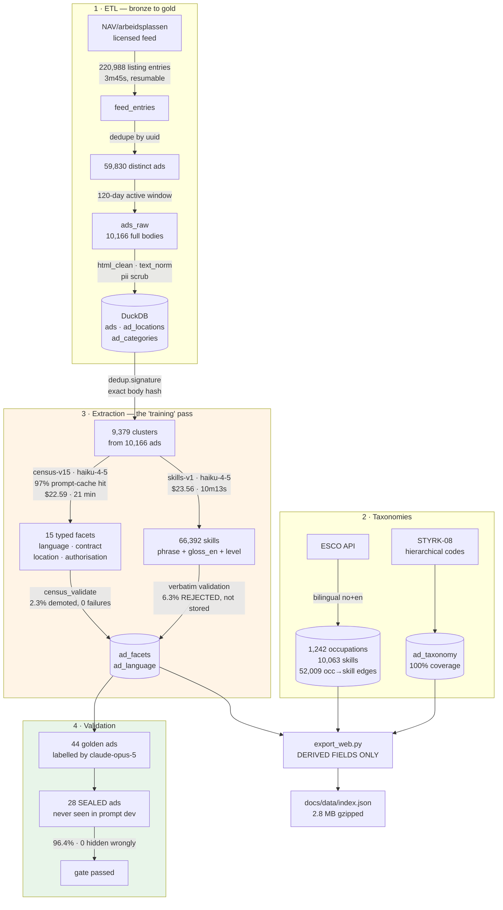
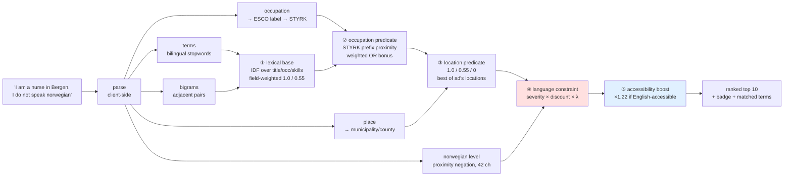

# Smart Search — constraint-aware job search over Norwegian job ads

**Search that respects *"I do not speak Norwegian."*** Type a sentence in English or
Norwegian; get a ranking that treats what you *lack* as a hard fact about the world rather
than as words to match. Every result shows its own reasoning: the parsed query, the
occupation code it resolved to, which skills matched, and a badge when an advertisement
demands Norwegian you do not have.

**[▶ Live demo](https://naomititus.github.io/finnno_smart_search/)** · **[What these numbers
do not support](LIMITATIONS.md)** — 23 sections of measured limits, disconfirmed
hypotheses, and bugs found after the tests were green.

---

## Headline

| | | |
|---|---:|---|
| **Query latency** | **174 ms** p50 · 224 ms p95 | full scan + rank of all 10,166 ads, in the browser, no server |
| **Time to interactive** | ~400 ms after download | 2.8 MB gzipped index · 86 ms parse · 309 ms index build |
| **Infrastructure at query time** | **none** | static GitHub Pages; no API call, no vector DB, no backend |
| **Ongoing cost to tag an ad** | **$0.0047** → **~$64/month** | $4.73 per 1,000 ads at ~443 new ads/day; the only cost that recurs |
| **One-off R&D** | **$8.30** | prompt development, golden set, 378 judgments — spent once, not per ad |
| **One-off backfill** | **$46.15** | tagging the existing 10,166-ad corpus; scales with corpus size, not time |
| **Extraction models** | `claude-haiku-4-5` | both censuses — 9,379 + 9,823 calls, 0 failures |
| **Judge + label model** | `claude-opus-5` | judging, and the golden skill labels haiku is scored against |
| **Throughput** | 9,823 ads in **10m13s** | Batch API, single submission |

**Why two models and not one.** The same skills prompt was piloted on both: Opus recall
**0.868**, Haiku recall **0.861** — inside noise — at **$130 vs $23** for the full corpus.
So extraction runs on Haiku and the money goes where a weak model cannot be repaired by
re-prompting: the **judge**, which decides whether any of this works, and the **golden
labels** Haiku is measured against. Scaling to 100× the corpus is $4.7k of Haiku, not
$13k of Opus, and the judging cost does not scale with the corpus at all.


### What it costs to run, separated properly

Three different kinds of money, and conflating them is how a pilot budget gets
mis-sold. Every figure below is **actual token usage pulled from the Batch API**, not an
estimate — my own estimates were out by 38% in one direction and 15% in the other.

**① Ongoing — the only cost that recurs.** Each new advertisement is tagged once:

| per advertisement | | per 1,000 ads |
|---|---:|---:|
| facet census (`census-v15`, 15 typed facets) | $0.00241 | $2.41 |
| skills census (`skills-v1`, 6.53 skills/ad) | $0.00232 | $2.32 |
| **total taxonomy cost per ad** | **$0.00473** | **$4.73** |

Arrival rate measured from the corpus itself — 443 ads/day over the 7 days before the
crawl, the window least distorted by expiry — so **~13,500 new ads/month ≈ $64/month,
$764/year** to keep the whole Norwegian market tagged. Query serving adds nothing: the
front end is static and calls no API.

Two levers, both measured rather than guessed. The skills census took **0% prompt-cache
hits** where the facet census took **97%** — 39% of each call is a static instruction
prefix, and marking it cacheable takes the bill to **$0.00426/ad (~$57/month)**, a 20%
saving still on the table. Body-hash deduplication already removes 3.4% of calls.

**② One-off R&D — $8.30, and it does not scale with the corpus.**

| | |
|---:|---|
| $2.42 | 18 prompt-development runs, 1,036 calls — fifteen census prompt versions |
| $1.33 | skills pilots on the 44 golden ads: Haiku $0.20, Opus $1.13 |
| $4.55 | **378 relevance judgments** across three rounds (`claude-opus-5`) |

This is the number that surprises people: **proving the thing works cost less than
$9.** It is fixed — judging 378 pairs costs the same whether the corpus is 10,000 ads
or 10 million. What is *not* in it is my time, which dominated: the golden skill labels
were authored by Opus precisely because I had no time to hand-label 144 of them (§15).

**③ One-off backfill — $46.15** to tag the existing 10,166 ads ($22.59 facets + $23.56
skills). This scales with corpus size, not with time, and it is the figure to quote for
a market you have not indexed yet — **~$4,700 per million advertisements**, or ~$4,260
with the caching lever. The same backfill on Opus would be **$130 per 10,166 ads**,
i.e. **$13,000 per million**, for +0.007 recall.

---

## The problem, and why embeddings cannot solve it

**Matching is containment, and similarity cannot express containment.** A job states the
requirements it has — a set **R**. A seeker has attributes **S**. The job is viable iff
**R ⊆ S**. Containment is **asymmetric**: needing Norwegian when you have only English is
fatal; having Norwegian when the job never asked is free. Cosine similarity is
**symmetric** and has no way to express that difference. No encoder, at any size, ranks on
containment.

This was measured before it was asserted, and the measurements broke the original framing:

- *"jeg snakker ikke norsk"* and *"jeg snakker flytende norsk"* collapse to **cosine
  0.914**, and stating the constraint moved the seeker **closer** to the ads demanding
  Norwegian on **5 of 5** personas. Declaring what you lack made results *worse*.
- But the corpus contains almost no negations to represent. **Absence is expressed by
  silence**: 36.5% of ads say nothing about language, 99.4% nothing about visa
  sponsorship, and only **93 of 10,166 (0.9%)** state Norwegian is not required.
- The ads that *are* accessible affirm **English** rather than negating Norwegian. 96.9% of
  Norwegian-demanding ads contain `norsk`, against 67.7% of accessible ones — which is
  *why* the query's own `norsk` token pulls it toward the ads it rules out.
- A control disconfirmed the tidy story. Padding a query drives cosine to 0.999, but a
  one-word **content** swap — nurse vs carpenter — is erased at the same rate. The real
  claim is broader: single-vector retrieval loses *any* single clause once queries are long,
  not negation specifically.

So the fix is architectural: **extract typed requirements from both sides and evaluate them
as predicates over metadata, in a separate tunable stage.** Full evidence in
[LIMITATIONS.md](LIMITATIONS.md) §12–§14, including both hypotheses it disproved.

---

## Architecture

### Build time — how the index is made

There is no gradient descent here. What stands in for "training" is a **typed extraction
pass** over every advertisement, validated against human-authored scenario tables and a
sealed held-out set, then joined to two public taxonomies and compiled to a static index.



The **sealed set** is the honesty mechanism: 28 advertisements withheld from every round of
prompt development, scored once. Prompt iteration happened on the other 16 — the alternative
is tuning until the numbers look good and calling that a result.

### Query time — what happens when you type

Five stages. **Three of them fail open**: an unstated *or* unresolvable constraint leaves
the ranking bit-identical, so a gazetteer miss can never quietly change a little.



Search runs **entirely in the browser** over the precomputed index. Per
[DATA_LICENSE.md](DATA_LICENSE.md) the bundle carries **derived fields only** — title, ESCO
labels, STYRK code, municipality, census language level, skill glosses — and every result
links back to the original ad on arbeidsplassen.no. No ad body text, employer names or
contact details are redistributed. **No automated access to finn.no was performed at any
point.**

---

## Scoring

### ① Lexical base — rarity, weighted by field

Term overlap over title + occupation labels ($T$) and skills + glosses + category ($S$),
each term contributing its rarity, normalised by the rarity available so scores stay
comparable across query lengths:

$$\mathrm{idf}(t) = \ln\!\left(1 + \frac{N}{\mathrm{df}(t)+1}\right), \qquad N = 10{,}166$$

$$\text{base} = \frac{\displaystyle\sum_{t \in Q} \mathrm{idf}(t)\,w_f(t) \;+\; \sum_{p \in B} \mathrm{idf}(p)\,w_f(p)}{\displaystyle\sum_{t \in Q}\mathrm{idf}(t) + \sum_{p \in B}\mathrm{idf}(p)}, \qquad w_f = \begin{cases}1.0 & \text{hit in } T\\ 0.55 & \text{hit in } S \text{ only}\end{cases}$$

Field weighting is not cosmetic: a term in the **job title** is far stronger evidence than
the same term buried in a skill list. Matching is on **word boundaries** — `includes("nurse")`
matched `nursery` and returned a kindergarten manager first.

**Bigrams $B$ earn their place or are dropped.** A pair is admitted only if it is
genuinely rarer than either of its parts, which is what stops `low voltage` from scoring
high-voltage ads:

$$B = \{\, p = (a,b) \;:\; \mathrm{idf}(p) > \max(\mathrm{idf}(a), \mathrm{idf}(b)) + 0.5 \,\}$$

Measured across 12 contrastive pairs: **4 better, 8 flat, 0 worse** (§23). It generalises
narrowly — where both qualifiers are content words with their own IDF, the unigrams already
separated them.

### ② Occupation — a predicate over STYRK codes, trusted in proportion to how it resolved

STYRK-08 codes are hierarchical, so shared prefix length *is* taxonomic distance:

$$\mathrm{prox}(c_q, c_{ad}) = \big[\,0,\;0.15,\;0.40,\;0.70,\;1.00\,\big]_{\,\min(\ell,\,4)}, \qquad \ell = \text{common prefix length}$$

How much that is trusted scales with how specifically the phrase resolved — treating a
precise hit and a vague one alike was a real defect:

$$\text{base} \leftarrow \begin{cases} \omega\cdot\mathrm{prox} + (1-\omega)\cdot\text{base}, & \omega = 0.78 \text{ exact ESCO label} \\[2pt] \omega\cdot\mathrm{prox} + (1-\omega)\cdot\text{base}, & \omega = 0.62 \text{ resolved to} \le 2 \text{ codes} \\[2pt] \text{base} + 0.18\cdot\mathrm{prox}, & \text{bare token} \to \text{many codes (bonus, never a gate)} \end{cases}$$

`engineer` resolves to six broad codes spanning 145 ads. Gated at 0.78 it made those 145
unbeatable — an AI-engineer query could not rank a data-engineering ad above an HVAC one.
A direct label match adds a further $+0.02$, enough to break ties on evidence rather than
corpus order.

### ③ Location — graded, best-of, fails open

$$\mathrm{lprox} = \max_{\,l \in \mathrm{locs}(ad)} \begin{cases} 1.00 & \text{exact municipality} \\ 0.55 & \text{same county} \\ 0.00 & \text{elsewhere} \end{cases} \qquad \text{base} \leftarrow \text{base}\cdot\big(1 - \lambda + \lambda\cdot\mathrm{lprox}\big)$$

`max` because 722 ads (7.1%) list several locations; a first-match implementation drops ads
that genuinely do list the city asked for.

### ④ The constraint stage — the one component that measurably works

Severity is **graded, not binary**, and multiplied by how much Norwegian the seeker
actually has:

$$\sigma = \underbrace{\mathrm{sev}(\ell_{ad})}_{\text{ad's demand}} \times \underbrace{\delta(\ell_{seeker})}_{\text{speaker discount}}$$

| $\mathrm{sev}$ | ad's stated level | | $\delta$ | seeker states |
|---:|---|---|---:|---|
| 1.0 | certified · professional · fluent | | 1.0 | none |
| 0.9 | scandinavian_accepted | | 0.8 | basic |
| 0.8 | conversational | | 0.6 | conversational |
| 0.5 | **silent** on a Norwegian ad | | 0.0 | fluent · native |
| 0.4 | desirable | | | |
| 0.0 | either_no_or_en · explicitly_not_required | | | |

**Silence scores 0.5, not 1.0.** That single default decides more advertisements than every
stated requirement combined — 3,507 (34.5%) blocked by silence alone against 5,703 (56.1%)
by a stated requirement. It is a **design decision, not evidence** (§3b).

### ⑤ Final score

$$\text{final} = \text{base} \times \underbrace{\beta}_{\substack{1.22 \text{ if English-accessible} \\ \text{and seeker lacks Norwegian}}} \times \underbrace{(1 - \lambda\sigma)}_{\text{constraint penalty}}$$

$\lambda$ is the slider on the demo, from 0 (off) to 1 (full). **At $\lambda = 0$, or when
the seeker said nothing, the ranking is bit-identical to the unconstrained one** — that
non-effect is the property the whole design protects, because a stage that applies to one
side of a paired comparison and not the other is a confound.

$\beta$ pulls workable ads **up** rather than only pushing blocking ads down — 956 ads are
English-accessible, 551 of them `either_norwegian_or_english`. It was once stacked with a
second boost, double-counting derived evidence at 1.32×; that bug put a sales role titled
"GTM Engineer" above three genuine automation matches. **It is also the open defect**: see
§23.1 below.

---

## Measured performance

### Retrieval — 378 judgments, `claude-opus-5` judge, `judge-v1`, 0 validation failures

The judge never sees the extractor's output, grades 0–3 on relevance, and flags constraint
violations on an **independent** axis. The protocol was **committed before any ablation
ran**, with one prompt revision allowed before human calibration and zero after
([JUDGING_PROTOCOL.md](eval/JUDGING_PROTOCOL.md)).

| rung | ΔCVR@10 | 95% CI | ΔnDCG@10 | 95% CI |
|---|---:|---|---:|---|
| raw → parsed query | +0.038 | [−0.008, +0.085] | **+0.124** | **[+0.017, +0.260]** |
| + occupation predicate | +0.000 | [−0.023, +0.023] | −0.014 | [−0.052, +0.015] |
| **+ constraint stage (λ=0.7)** | **−0.077** | **[−0.138, −0.023]** | **−0.049** | **[−0.103, −0.005]** |
| + ESCO skills (either resolver) | +0.000 | [−0.023, +0.023] | +0.024 | [−0.017, +0.071] |

Bootstrap: 10,000 replicates, percentile method, **resampling the persona (n=13) and not
the advertisement** — ten ads from one persona share a query and a pool, so treating them
as independent would report an interval several times too narrow and turn noise into
significance.

**Absolute, and the negative result the architecture rests on:**

| arm | CVR@10 | nDCG@10 | MRR@10 |
|---|---:|---:|---:|
| BM25 over the parsed query | 0.154 | **0.798** | 0.923 |
| + constraint stage (λ=0.7) | **0.077** | 0.735 | 0.923 |
| **dense retrieval** | **0.277** | **0.383** | 0.560 |

**The dense channel is the worst arm on every measure** — roughly half the nDCG of every
lexical arm at more than double the violation rate. That is the point, not a disappointment.

**Read honestly, this is one win and five nothings.** The constraint stage halves
violations — and it is a genuine **trade**, because the nDCG cost is *also* significant.
Quoting the first without the second would be dishonest. Five plausible components measured
as **no effect at all**: the occupation predicate, both skill resolvers, IDF weighting on
the query it was built for, and the label bonus. The one rung that clearly earns its place
on relevance is **parsing the query at all**.

### Extraction

| | measured | on |
|---|---|---|
| Language level, **sealed held-out set** | **27/28 = 96.4%** | 28 ads never seen during prompt development |
| — per level | 1.00 on all six stated levels; **0.67 on `unstated` (n=3)** | |
| — accessibility errors | **0 hidden wrongly** · 1 shown wrongly (4.5%) | CI [0, 0.39] — n too small to bound |
| Facet census, full corpus | 9,379 calls · $22.59 · 2.3% demoted · **0 failures** | 10,166 ads |
| Skills, coverage | **98.4%** (from 32.8%) · 6.53 skills/ad · 66,392 total | |
| Skills, recall vs golden | **0.868** (from 0.104) | 44 ads labelled by `claude-opus-5` |
| — rejection rate | **6.3%** failed verbatim validation, **discarded not stored** | 4,433 of 70,825 returned |

Skills recall is agreement with labels **Opus produced**, not human labels — an upper bound
on agreement, not on correctness. Due to time constraints I could not validate the 144
golden skill labels myself; Opus was enlisted to prove the concept. This is recorded as a
standing caveat in §15, not buried.

### The shipped page — 23-query suite across ten industries

- **83% industry match in top-5** (95/115) · 0 language parse failures · 0 place parse
  failures · 1 occupation unresolved
- **5/6 discrimination pairs**: data / electrical / software engineer and nurse all clean
  at 5/5 with no bleed; mechanical leaks 1

Run it yourself: `node scripts/check_demo_queries.mjs`.

### The three limits that matter most

1. **The page's ranking has never been judged.** Every interval above comes from the Python
   pipeline; `docs/index.html` is a *second implementation*. The 83% is my own standard, not
   the judge's. This is the largest outstanding item (§22).
2. **n = 13 personas.** The constraint result excludes zero. Nothing else does.
3. **The 1.22× accessibility boost can override topical fit** (§23.1). Ask for an upper-secondary
   teacher *and* say you do not speak Norwegian, and you get PhD fellowships — because the
   flat multiplier lifts the whole English pool over the Norwegian one, and this corpus's
   English ads are academic. **CVR@10 scores that as a success**, because it measures
   language accessibility. That is a measurement gap before it is a ranking gap.

---

## Everything used to make it work

| layer | what | why this one |
|---|---|---|
| **Extraction LLM** | `claude-haiku-4-5` | 0.861 recall vs Opus's 0.868 at a sixth of the cost; both censuses |
| **Judge + labeller** | `claude-opus-5` | a weak judge cannot be repaired by re-prompting; also authored the golden skill labels |
| **Batch API** | 50% discount, `custom_id` constrained | 9,823 calls in 10m13s; `^[a-zA-Z0-9_-]{1,64}$` rejected all 346 of my first attempt |
| **Prompt caching** | 97% hit on the facet census | *"the number that sets the bill"* — and 0% on the skills census, a 20% saving left on the table |
| **Structured output** | tool-use schema + verbatim validation | every skill must appear in the source text or be rejected |
| **Encoder** | `paraphrase-multilingual-mpnet-base-v2` via **ONNX Runtime** | bilingual; **not** nb-sbert-base, which this project has never run (§12) |
| **Lexical retrieval** | BM25 with **stem chains** + bilingual stopwords + char 3–5-grams | Norwegian Snowball strips one suffix per call; closed compounds need n-grams |
| **Occupation taxonomy** | **STYRK-08** hierarchical codes | prefix length is taxonomic distance, so proximity is free |
| **Skills/occupation graph** | **ESCO** — 1,242 occs · 10,063 skills · 52,009 edges, bilingual | `gloss_en` routes matching through English, where the noise floor is lowest |
| **Store** | **DuckDB** | single-file OLAP; 16 tables, 220,988 feed rows, embedded |
| **Evaluation** | TREC **depth-10 pooling** · CVR@10 · nDCG@10 (gains $2^g-1$) · MRR@10 · ΔCVR_paired | pooling bias is the failure mode, and it bit once (§17) |
| **Statistics** | percentile bootstrap, 10,000 replicates, **persona-level** resampling | ad-level resampling would fake significance |
| **Front end** | vanilla JS, zero dependencies, static Pages | no backend to run; the λ slider makes the effect visible rather than asserted |
| **Method** | TDD gate: ground → scenario table → **human approval** → failing tests → implement | [STANDARDS.md](STANDARDS.md) §3; §3.1 lists seven bugs that had green tests |

**All of it, and what it does not support, is in [LIMITATIONS.md](LIMITATIONS.md)** — 23
sections including the two hypotheses the probes disproved, the ablation that could not
measure its own fix, and every component that measured as nothing.

---

## Corpus

| | |
|---|---|
| Corpus | **10,166** active ads, full body text, 120-day window |
| Feed walk | 220,988 listing entries → 59,830 distinct ads, 3m45s, resumable |
| DuckDB | 16 tables · `ad_locations` 12,003 rows (7.1% of ads list several) |
| ESCO graph | 1,242 occupations · 10,063 skills · 52,009 occ→skill edges, bilingual |
| Accessible to an English speaker | **956 ads (9.4%)** — the needle in the haystack |
| Blocked by a STATED requirement | 5,703 (56.1%) |
| Blocked by SILENCE alone | **3,507 (34.5%)** — a default, not a finding (§3b) |

Earlier drafts reported 4.33% accessible and 74.6% silent. Both predated the census and
were estimates; **the 74.6% figure was wrong by a factor of two.** It is corrected here
rather than quietly dropped.

Two further corpus facts worth stating because they shaped the design: **FINN ads are
excluded from the licensed feed** (`source:"FINN"` uuids return HTTP 404; zero appear among
10,166 — hence the project name is a misnomer), and **the positive class has almost no
lexical signal** — a 22-pattern bilingual lexicon fires `not_required` on **5 ads in
10,166**. English-accessible ads do not announce themselves; they are simply written in
English. Detection is langid, not classification.

---

## Layout

```
src/finn_smart_search/
  ingest/        nav_feed.py  silver.py  store.py  anthropic_client.py
  understanding/ census_prompt.py  census_validate.py  skills_prompt.py
                 dedup.py  html_clean.py  langid.py  taxonomy.py  text_norm.py
  esco/          fetch.py
  retrieval/     bm25.py  constraints.py  occupation.py  location.py  skills_match.py
  eval/          judge_llm.py  metrics.py  pool.py  stats.py  scoring.py
                 gold_parse.py  sealed_ingest.py  skills_scoring.py
eval/            JUDGING_PROTOCOL.md  GOLD_PARSE_SCHEMA.md  JUDGE_SCENARIOS.md
                 personas.yaml  gold_parses.yaml  golden_skills.json
                 judgments.json  demo_queries.json
scripts/         run_skills_census.py  run_judgments.py  export_web.py
                 check_demo_queries.mjs  (+ 12 probe_*.py)
docs/            index.html  data/index.json      <- the GitHub Pages demo
reports/         every probe, census and ablation log, kept including the wrong ones
```

## Running it

**The demo needs nothing installed.** It is live at
**[naomititus.github.io/finnno_smart_search](https://naomititus.github.io/finnno_smart_search/)**
— GitHub Pages serves a 2.9 MB gzipped index as a static file, and all search runs in the
visitor's browser. No server, no API key, no vector database, nothing to spin up.

To serve it locally you need a static file server, **not** a double-click: the page
`fetch()`es `data/index.json`, which browsers block over `file://`.

```bash
python3 -m http.server 8000 --directory docs   # then open localhost:8000
```

## Rebuilding from source

These are for regenerating the index, not for running the demo. They need the licensed NAV
feed, an `ANTHROPIC_API_KEY`, and the gitignored `data/` directory.

```bash
pip install -e ".[dev]"
python run_ingest.py --days 120              # resumable; ~35 min, polite rate limits
python run_esco.py                           # ~20 min
python scripts/run_skills_census.py           # DRY RUN by default; --submit to spend
python scripts/export_web.py                  # rebuild docs/data/index.json
node scripts/check_demo_queries.mjs           # the 23-query suite
pytest                                        # the TDD gate
```

Every script that spends money is a **dry run by default** and prints its estimate first.
`data/` is gitignored — no ad text, employer names or contact details are redistributed.
See [DATA_LICENSE.md](DATA_LICENSE.md).
